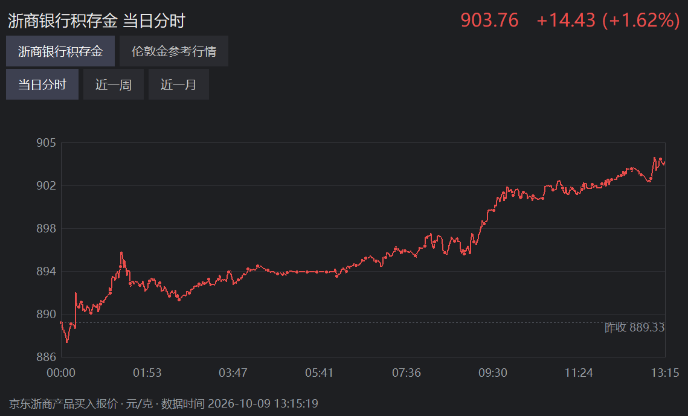
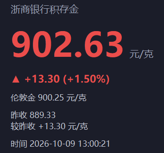
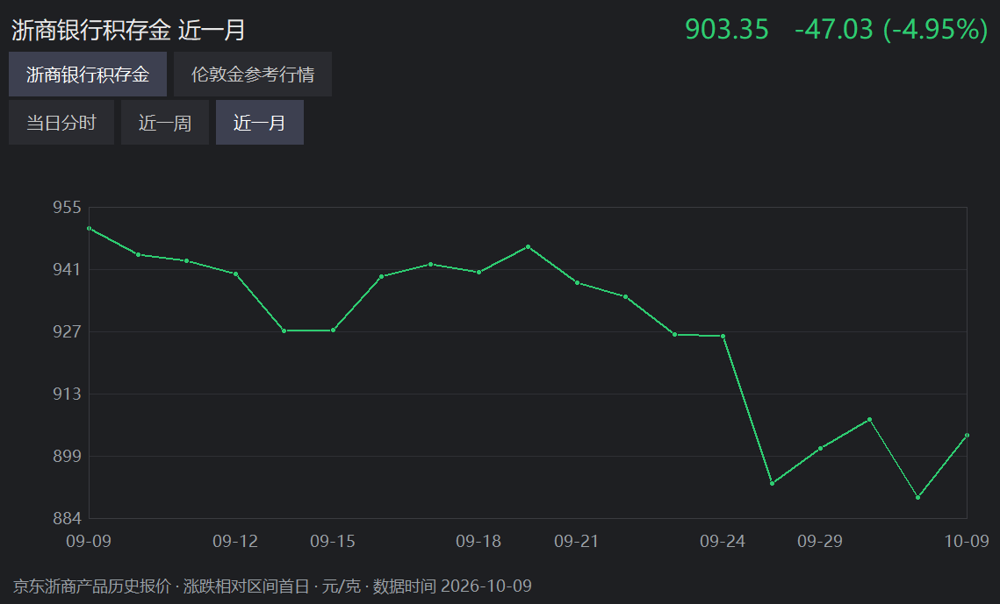

# 金价托盘 GoldPriceTray

[](LICENSE)
[](#)
[](#)
[](releases)
[](https://github.com/suming233/gold-price-tray/actions/workflows/build.yml)

**Windows 任务栏实时金价小工具**——托盘图标直接显示金价数字，鼠标悬停弹出大字体详情卡，双击查看走势图。

[English](#english) | 中文



| 悬停详情卡 | 近一月走势 |
| --- | --- |
|  |  |

## 功能

- **托盘图标显示实时金价**，默认显示**浙商银行积存金**（元/克）
- **悬停详情卡**：整体按 1.5 倍放大，价格数字 69px 加粗并单独染涨跌色，单位与其余信息用小字
- **走势图**：单击或双击图标打开伦敦金参考行情，可切换当日分时 / 近一周 / 近一月；重复打开复用窗口
- **品种切换**：浙商银行积存金（默认）、伦敦金 XAU/USD、纽约黄金、沪金 99、黄金 T+D，重启后保留选择
- **涨红跌绿**，符合国内行情习惯
- 每 30 秒自动刷新，支持开机自启
- 同品种更新失败时保留上次报价，并在提示与悬停卡标注；切换品种会先显示加载状态
- 行情请求直接联网，不继承环境代理；汇率不可用时不会把美元价格误标为元/克
- 单实例互斥，重复启动不会多出图标
- **磁盘占用有界**：日志只在有意义的事件上落盘并自动轮转（见下）

## 安装

### 方式一：用现成的安装包（推荐）

从本仓库 [Releases](releases) 页面下载
`GoldPriceTray_Setup.exe`（约 19MB），双击运行即可。

安装程序会自动完成：

- 安装到 `%LOCALAPPDATA%\GoldPriceTray`
- 注册开机自启
- 创建桌面和开始菜单快捷方式
- 写入系统的"应用和功能"卸载列表

这个 exe 有三种身份：

| 场景 | 行为 |
| --- | --- |
| 在没装过的机器上双击 | 弹出安装向导 |
| 加 `/silent` 参数 | 静默安装，无窗口 |
| 双击已安装目录里的 exe | 正常启动托盘 |

### 方式二：从源码运行

```bash
pip install -r requirements.txt
python gold_price_tray.py
```

### 卸载

三个入口任选：托盘右键菜单 → 卸载并移除 / 系统的"应用和功能" / 重新运行安装包点卸载。

## 打包自己的 exe

```bash
pip install pyinstaller
build.bat
```

产物在 `dist/GoldPriceTray.exe`。

不想本地打包也没关系：本仓库配了 GitHub Actions，**推送 `v*` 标签会自动在
windows-latest 上打包，并把 `GoldPriceTray_Setup.exe` 挂到对应的 Release**；
也可以在 Actions 页面手动点 Run workflow 只构建不发布。

## 磁盘占用

程序本身只有一个 exe（约 18 MB）和一个日志文件，日志是唯一会随时间增长的文件。

日志采用**事件驱动 + 硬上限**两条规则，保证长期运行也不会堆积：

| 规则 | 说明 |
| --- | --- |
| 只记有意义的事 | 首次取到价、涨跌方向翻转（10 分钟最小间隔）、取数失败、失败恢复、每小时心跳 |
| 不记的内容 | 每 30 秒一次的正常刷新结果 —— 托盘图标本身就是实时显示，日志里再抄一遍没有信息量 |
| 大小轮转 | 按字节限制为 256 KB，轮转时最多保留 800 行，异常消息也有长度上限 |

实测一天的实际写入量：

| 行情 | 写入量 | 年化 |
| --- | --- | --- |
| 平稳 | 24 行 / 1.5 KB | ≈ 0.5 MB |
| 极端震荡（方向每 30 秒翻转） | 144 行 / 9.7 KB | ≈ 3.5 MB |

对比改造前每 30 秒无条件写一行（2880 行 / 151 KB / 天，约 **51 MB/年**），
平稳行情下削减约 99%。配合 256 KB 轮转上限，无论行情多极端占用都不会超界。

## 数据源

| 用途 | 接口 |
| --- | --- |
| 浙商银行积存金（默认） | `api.jdjygold.com/gw2/generic/jrm/h5/m/stdLatestPrice?productSku=1961543816` |
| 伦敦金（美元/盎司，24h 连续） | `hq.sinajs.cn/list=hf_XAU` |
| 沪金 99 / 黄金 T+D / 纽约黄金 | `hq.sinajs.cn/list=gds_AU9999` 等 |
| 美元/人民币汇率 | `hq.sinajs.cn/list=fx_susdcny` |
| 日 K 线（2006 年至今） | `GlobalFuturesService.getGlobalFuturesDailyKLine?symbol=XAU` |
| 分时（1 分钟粒度） | `GlobalFuturesService.getGlobalFuturesMinLine?symbol=XAU&type=5` |

换算式（仅国际品种需要）：

```
元/克 = 美元/盎司 × 汇率 ÷ 31.1035
```

（1 金衡盎司 = 31.1035 克）

> 浙商银行积存金的公开接口只提供当前价与昨收，**不提供开高低与 K 线**，
> 因此悬停卡在该品种下不显示最高/最低/今开。走势图的曲线取自伦敦金，
> 其"昨收"基准线也同步改用伦敦金自身的昨收，避免与曲线错位。

## 免责声明

行情数据来自第三方公开接口，仅供个人参考，不构成投资建议，不保证实时性与准确性。

## English

**GoldPriceTray** is a lightweight Windows tray app that shows the live gold
price right on your taskbar — by default the **China Zheshang Bank gold
accumulation plan** quote (CNY per gram).

- Tray icon shows the live price; hover for a detailed pop-up card
- Click the icon for London gold reference charts; intraday / 1-week / 1-month views
- Remembers the selected symbol; marks cached quotes when updates fail
- Multiple symbols: Zheshang accumulation gold, London gold, COMEX gold,
  SHFE gold, Gold T+D
- Refreshes every 30 s; optional start-up with Windows; single-instance guard
- One-file installer: double-click to install (silent mode: `/silent`),
  uninstall from the tray menu or Windows "Apps & features"

Download `GoldPriceTray_Setup.exe` from the
[Releases](releases) page and double-click — no Python required.

Data sources: JD Finance gold quote API (Zheshang Bank accumulation gold,
current price and previous close only) and Sina Finance public quotes for the
international and other domestic symbols. For personal reference only, not
investment advice.

## License

[MIT](LICENSE)
